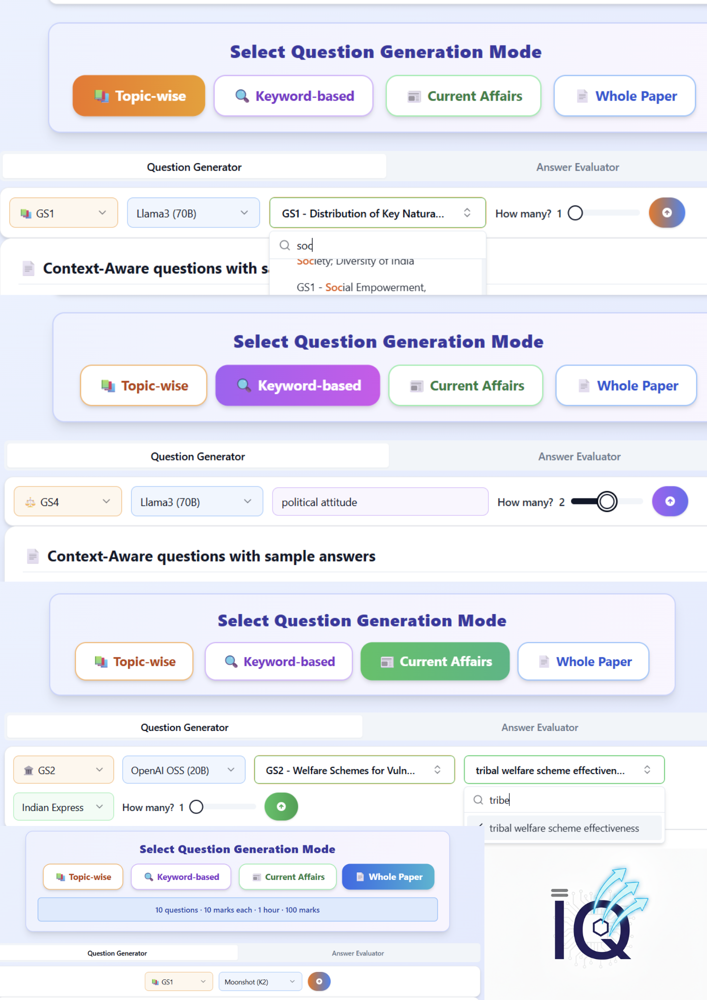

# IntrepidQ AI

**A minimalistic AI (NLP + RAG) system that curates context-aware Questions & sample Answers designed to make you think**

<div align="center">
  
  
  
  
  
</div>

<p align="center">
  <strong>Transform your UPSC preparation with India's first NLP + RAG based UPSC CSE AI platform</strong><br>
  Generate contextually-aware, high-quality UPSC Mains questions powered by advanced NLP and vector search
</p>


-------------------------------------------------------------------------------------------------------------------------

## 🌟 What's New in IntrepidQ

✨ **Enhanced AI Engine**: Multi-model support (Groq, Google Gemini)  
🔄 **Smart Caching**: Supabase-based intelligent question caching system  
👥 **Guest Support**: IP-based rate limiting for anonymous users  
🎯 **Adaptive Performance**: Dynamic model selection based on response times  
🔐 **Enterprise Security**: Row-Level Security (RLS) and JWT authentication  
📊 **Advanced Analytics**: Comprehensive user statistics and feedback tracking  
🐳 **Docker Ready**: Full containerization for seamless deployment  
📦 **Intelligent current affairs support**: Generate current affairs with users choice of news source

## 🎯 Features

### 🤖 AI-Powered Question Generation
- **Multi-Model Support**: Leverage Groq models and Google Gemini
- **Contextual Awareness**: Vector similarity search using FAISS and pgvector
- **Adaptive Performance**: Automatic model selection based on speed and reliability
- **Topic-Specific**: Generate questions for specific GS1-GS4 topics
- **Whole Paper Mode**: Create complete practice papers
- **Current affairs support**:  Generate current affairs with users choice of news source

### 🔐 User Management & Security
- **Google OAuth Integration**: Seamless authentication via Supabase
- **Guest User Support**: Anonymous access with IP-based rate limiting
- **Daily Limits**: 5 questions/day for authenticated users, 2/day for guests
- **Row-Level Security**: Database-level access controls
- **JWT Token Management**: Secure session handling

### 📊 Analytics & Performance
- **Real-time Statistics**: Track generation counts, success rates, and usage patterns
- **User Dashboard**: Personalized analytics and study progress
- **Model Performance Tracking**: Monitor AI model response times and reliability
- **Website Feedback System**: use floating feeback form
- **Usage Analytics**: Comprehensive event tracking

### 🗄️ Database & Caching
- **Modular Schema**: Organized PostgreSQL database with 9+ tables
- **Intelligent Caching**: Supabase-based question caching with TTL
- **Vector Storage**: pgvector for similarity search and document embeddings
- **Automatic Cleanup**: Scheduled maintenance using pg_cron
- **Real-time Subscriptions**: Live data updates via Supabase

### 🎨 Modern UI/UX
- **Responsive Design**: Mobile-first approach with Tailwind CSS
- **shadcn/ui Components**: Beautiful, accessible UI components
- **Dark Mode Support**: Theme switching capabilities
- **Progressive Web App**: Optimized for all devices
- **Real-time Updates**: Live question generation status


### Technology Stack


#### 🎨 Frontend
- **Next.js 14+**: React framework with SSR/SSG capabilities
- **TypeScript**: Type-safe development
- **Tailwind CSS**: Utility-first CSS framework
- **shadcn/ui**: High-quality UI component library
- **React Hook Form**: Efficient form handling with validation
- **Recharts**: Beautiful data visualization
- **Supabase Client**: Real-time database and auth integration


#### ⚡ Backend
- **FastAPI**: High-performance Python web framework
- **LangChain**: LLM application development framework
- **Pydantic**: Data validation and settings management
- **Uvicorn**: Lightning-fast ASGI server
- **Python 3.8+**: Core runtime environment

#### 🤖 AI & ML
- **Groq**: Ultra-fast LLM inference
- **Google Gemini**: Advanced language understanding
- **Sentence Transformers**: Text embedding generation
- **FAISS**: Efficient similarity search
- **PyTorch**: Machine learning computations
- **Tavily search**:  News API for effective search

#### 🗃️ Database & Infrastructure
- **Supabase**: Backend-as-a-Service platform for authentication and database
- **pgvector**: PostgreSQL extension for vector similarity search
- **PostgreSQL**: Robust relational database
- **upstash**:  Redis-like data store and for database caching
- **Docker**: Containerization platform
- **Vercel**: Frontend deployment platform
- **Render/Railway**: Backend deployment platform


## 🚀 Quick Start

### Prerequisites

- **Python 3.8+** with pip
- **Node.js 16+** with npm
- **Docker** (optional, recommended)
- **Supabase Account** (free tier available)
- **API Keys**: Groq, Google Gemini (optional)

### 🐳 Docker Setup (Recommended)

```bash
# Clone the repository
git clone https://github.com/Hardhikman/IntrepidQ.git
cd IntrepidQ

# Start all services
docker-compose up --build

# Access the application
# Frontend: http://localhost:3000
# Backend API: http://localhost:8000
# API Docs: http://localhost:8000/docs
```

### 🛠️ Manual Setup

#### 1. Backend Setup

```bash
# Navigate to backend
cd backend/ai_service

# Create virtual environment
python -m venv venv
source venv/bin/activate  # Windows: venv\Scripts\activate

# Install dependencies
pip install -r requirements.txt

# Configure environment
cp .env.example .env

# Start backend server
uvicorn api.main:app --reload --host 0.0.0.0 --port 8000
```

#### 2. Frontend Setup

```bash
# Open new terminal and navigate to frontend
cd frontend

# Install dependencies
npm install

# Configure environment
cp .env.local.example .env.local

# Start development server
npm run dev
```

## ⚙️ Configuration

### Environment Variables

#### Backend (.env)
```env
SET API keys here
```

#### Frontend (.env.local)
```env
SET API keys and URL here
```

### Database Schema

| Table | Purpose | Key Features |
|-------|---------|-------------|
| `user_profiles` | User management | Daily limits, preferences, streak tracking |
| `generated_questions` | Question history | Full question tracking with metadata |
| `usage_analytics` | Event tracking | Comprehensive usage analytics |
| `question_feedback` | User feedback | Rating and comment system |
| `questions_cache` | LLM caching | Intelligent caching with TTL |
| `guest_generations` | Guest tracking | IP-based rate limiting |
| `model_performance` | AI metrics | Model speed and reliability tracking |
| `documents` | Vector storage | Document embeddings for similarity search |
| `topic_index` | Question indexing | Efficient topic-based question retrieval |

## 🎮 Usage Guide

### For Authenticated Users

1. **Sign In**: Use Google OAuth to authenticate
2. **Generate Questions**: 
   - Select type of Question generation mode
   - Select subject (GS1-GS4)
   - Choose specific topic or keyword or generate full paper
   - Select preferred AI model
3. **Review Results**: View generated questions with metadata
4. **Track Progress**: Monitor statistics in dashboard

### For Guest Users

1. **Limited Access**: 2 questions per day per IP address
2. **Basic Features**: Question generation without history
3. **Sign-up Prompts**: Encouraged to create account for full access


## 📈 Performance Monitoring

- **Response Time**: < 2 seconds for question generation
- **Cache Hit Rate**: > 80% for repeated queries
- **Model Success Rate**: > 95% generation success
- **Daily Active Users**: Tracked via analytics
- **Error Rates**: Monitored through custom logging


## 📄 License

This project is licensed under the Apache 2.0 License - see the [LICENSE](LICENSE) file for details.


<div align="center">
  <p><strong>Built with ❤️ for the UPSC Community</strong></p>
  <p>Made by <a href="https://github.com/Hardhikman">@Hardhikman</a></p>
</div>
