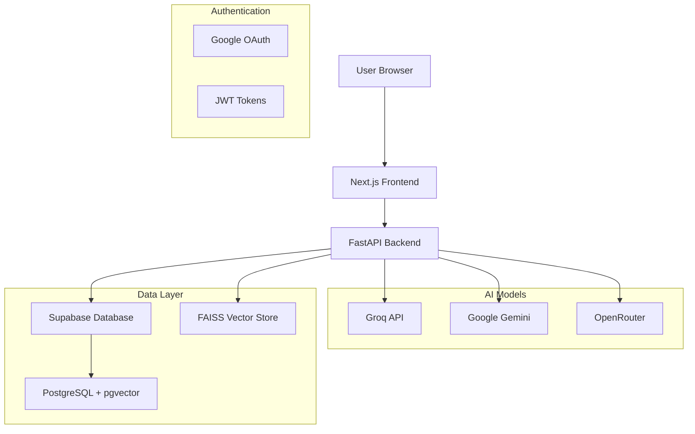

# IntrepidQ

**A minimalistic AI (NLP + RAG) system that curates context-aware Q&A designed to make you think**

<div align="center">
  
  
  
  
  
</div>

<p align="center">
  <strong>Transform your UPSC preparation with cutting-edge AI technology</strong><br>
  Generate contextually-aware, high-quality UPSC Mains questions powered by advanced NLP and vector search
</p>

<div align="center">
  <a href="#-quick-start">Quick Start</a> •
  <a href="#-features">Features</a> •
  <a href="#-architecture">Architecture</a> •
  <a href="#-deployment">Deployment</a>
</div>

---

## 🌟 What's New in IntrepidQ

✨ **Enhanced AI Engine**: Multi-model support (Groq, Google Gemini, OpenRouter)  
🔄 **Smart Caching**: Supabase-based intelligent question caching system  
👥 **Guest Support**: IP-based rate limiting for anonymous users  
🎯 **Adaptive Performance**: Dynamic model selection based on response times  
🔐 **Enterprise Security**: Row-Level Security (RLS) and JWT authentication  
📊 **Advanced Analytics**: Comprehensive user statistics and feedback tracking  
🐳 **Docker Ready**: Full containerization for seamless deployment  

## 🎯 Features

### 🤖 AI-Powered Question Generation
- **Multi-Model Support**: Leverage Groq LLaMA, Google Gemini, and OpenRouter models
- **Contextual Awareness**: Vector similarity search using FAISS and pgvector
- **Adaptive Performance**: Automatic model selection based on speed and reliability
- **Topic-Specific**: Generate questions for specific GS1-GS4 topics
- **Whole Paper Mode**: Create complete practice papers

### 🔐 User Management & Security
- **Google OAuth Integration**: Seamless authentication via Supabase
- **Guest User Support**: Anonymous access with IP-based rate limiting
- **Daily Limits**: 5 questions/day for authenticated users, 2/day for guests
- **Row-Level Security**: Database-level access controls
- **JWT Token Management**: Secure session handling

### 📊 Analytics & Performance
- **Real-time Statistics**: Track generation counts, success rates, and usage patterns
- **User Dashboard**: Personalized analytics and study progress
- **Model Performance Tracking**: Monitor AI model response times and reliability
- **Feedback System**: Rate and comment on generated questions
- **Usage Analytics**: Comprehensive event tracking

### 🗄️ Database & Caching
- **Modular Schema**: Organized PostgreSQL database with 9+ tables
- **Intelligent Caching**: Supabase-based question caching with TTL
- **Vector Storage**: pgvector for similarity search and document embeddings
- **Automatic Cleanup**: Scheduled maintenance using pg_cron
- **Real-time Subscriptions**: Live data updates via Supabase

### 🎨 Modern UI/UX
- **Responsive Design**: Mobile-first approach with Tailwind CSS
- **shadcn/ui Components**: Beautiful, accessible UI components
- **Dark Mode Support**: Theme switching capabilities
- **Progressive Web App**: Optimized for all devices
- **Real-time Updates**: Live question generation status

## 🏗️ Architecture

### System Overview


### Technology Stack


#### 🎨 Frontend
- **Next.js 14+**: React framework with SSR/SSG capabilities
- **TypeScript**: Type-safe development
- **Tailwind CSS**: Utility-first CSS framework
- **shadcn/ui**: High-quality UI component library
- **React Hook Form**: Efficient form handling with validation
- **Recharts**: Beautiful data visualization
- **Supabase Client**: Real-time database and auth integration

[**Live Demo**](https://intrepid-q1-nzmt.vercel.app/) | [**Report a Bug**](https://github.com/Hardhikman/IntrepidQ1/issues/new) | [**Request a Feature**](https://github.com/Hardhikman/IntrepidQ1/issues/new)


#### ⚡ Backend
- **FastAPI**: High-performance Python web framework
- **LangChain**: LLM application development framework
- **Pydantic**: Data validation and settings management
- **Uvicorn**: Lightning-fast ASGI server
- **Python 3.8+**: Core runtime environment

#### 🤖 AI & ML
- **Groq**: Ultra-fast LLM inference
- **Google Gemini**: Advanced language understanding
- **OpenRouter**: Multi-model API access
- **Sentence Transformers**: Text embedding generation
- **FAISS**: Efficient similarity search
- **PyTorch**: Machine learning computations

#### 🗃️ Database & Infrastructure
- **Supabase**: Backend-as-a-Service platform
- **PostgreSQL**: Robust relational database
- **pgvector**: Vector similarity search extension
- **Docker**: Containerization platform
- **Vercel**: Frontend deployment platform

## 📂 Project Structure

```
IntrepidQ2/
├── 📁 backend/
│   ├── 📁 ai_service/              # FastAPI application
│   │   ├── 📁 api/                 # API routes and models
│   │   │   ├── main.py            # FastAPI app entry point
│   │   │   ├── auth.py            # Authentication middleware
│   │   │   ├── models.py          # Pydantic data models
│   │   │   └── 📁 routes/         # API endpoint definitions
│   │   │       ├── questions.py   # Question generation endpoints
│   │   │       ├── auth.py        # Auth endpoints
│   │   │       ├── analytics.py   # Analytics endpoints
│   │   │       └── subjects.py    # Subject management
│   │   ├── 📁 core/               # Business logic
│   │   │   ├── question_generator.py # AI question generation
│   │   │   ├── vector_indexer.py     # Document vectorization
│   │   │   ├── supabase_client.py    # Database integration
│   │   │   └── pdf_parser.py         # PDF processing
│   │   ├── requirements.txt        # Python dependencies
│   │   ├── Dockerfile             # Backend containerization
│   │   └── validate_setup.py      # Environment validation
│   └── 📁 db/                     # Database schema
│       ├── 01_user_management.sql # User tables and functions
│       ├── 02_question_generation.sql # Question tracking
│       ├── 03_analytics_feedback.sql  # Analytics tables
│       ├── 04_caching_performance.sql # Caching system
│       ├── 05_guest_management.sql    # Guest user handling
│       ├── 06_statistics_dashboard.sql # Dashboard functions
│       ├── 07_utilities.sql           # Helper functions
│       ├── 08_vector_storage.sql      # Vector storage
│       ├── setup_automatic_cleanup.sql # Automated maintenance
│       ├── verify_deployment.sql      # Deployment verification
│       └── README.md                  # Database documentation
├── 📁 frontend/                   # Next.js application
│   ├── 📁 components/            # React components
│   │   ├── ui/                   # shadcn/ui components
│   │   ├── auth/                 # Authentication components
│   │   ├── dashboard/            # Dashboard components
│   │   └── questions/            # Question-related components
│   ├── 📁 pages/                # Next.js pages
│   │   ├── api/                  # API routes (if any)
│   │   ├── auth/                 # Authentication pages
│   │   ├── dashboard/            # Dashboard pages
│   │   └── questions/            # Question generation pages
│   ├── 📁 lib/                  # Utility libraries
│   │   ├── supabase.ts          # Supabase client configuration
│   │   ├── utils.ts             # Helper utilities
│   │   └── constants.ts         # Application constants
│   ├── 📁 hooks/                # Custom React hooks
│   ├── package.json             # Node.js dependencies
│   ├── Dockerfile              # Frontend containerization
│   └── next.config.js          # Next.js configuration
├── docker-compose.yml           # Multi-container orchestration
├── .gitignore                  # Git ignore rules
└── README.md                   # This file
```

## 🚀 Quick Start

### Prerequisites

- **Python 3.8+** with pip
- **Node.js 16+** with npm
- **Docker** (optional, recommended)
- **Supabase Account** (free tier available)
- **API Keys**: Groq, Google Gemini (optional)

### 🐳 Docker Setup (Recommended)

```bash
# Clone the repository
git clone https://github.com/Hardhikman/IntrepidQ.git
cd IntrepidQ2

# Start all services
docker-compose up --build

# Access the application
# Frontend: http://localhost:3000
# Backend API: http://localhost:8000
# API Docs: http://localhost:8000/docs
```

### 🛠️ Manual Setup

#### 1. Backend Setup

```bash
# Navigate to backend
cd backend/ai_service

# Create virtual environment
python -m venv venv
source venv/bin/activate  # Windows: venv\Scripts\activate

# Install dependencies
pip install -r requirements.txt

# Configure environment
cp .env.example .env
# Edit .env with your API keys and database credentials

# Start backend server
uvicorn api.main:app --reload --host 0.0.0.0 --port 8000
```

#### 2. Frontend Setup

```bash
# Open new terminal and navigate to frontend
cd frontend

# Install dependencies
npm install

# Configure environment
cp .env.local.example .env.local
# Edit .env.local with your Supabase configuration

# Start development server
npm run dev
```

#### 3. Database Setup

```bash
# In Supabase SQL Editor, run these files in order:
# 1. backend/db/01_user_management.sql
# 2. backend/db/02_question_generation.sql
# 3. backend/db/03_analytics_feedback.sql
# 4. backend/db/04_caching_performance.sql
# 5. backend/db/05_guest_management.sql
# 6. backend/db/06_statistics_dashboard.sql
# 7. backend/db/07_utilities.sql
# 8. backend/db/08_vector_storage.sql

# Optional: Setup automatic cleanup
# backend/db/setup_automatic_cleanup.sql

# Verify deployment
# backend/db/verify_deployment.sql
```
## ⚙️ Configuration

### Environment Variables

#### Backend (.env)
```env
# Supabase Configuration
SUPABASE_URL=https://your-project.supabase.co
SUPABASE_ANON_KEY=your_anon_key
SUPABASE_SERVICE_ROLE_KEY=your_service_role_key

# AI Model APIs
GROQ_API_KEY=your_groq_api_key
GOOGLE_API_KEY=your_google_api_key  # Optional
OPENROUTER_API_KEY=your_openrouter_key  # Optional

# Application Settings
SECRET_KEY=your_jwt_secret_key
CORS_ORIGINS=http://localhost:3000
ENVIRONMENT=development

# Model Configuration
GROQ_TEMPERATURE=0.7
DEFAULT_MODEL=llama3-70b

# Rate Limiting
DAILY_LIMIT=5
GUEST_DAILY_LIMIT=2
```

#### Frontend (.env.local)
```env
# Supabase Configuration
NEXT_PUBLIC_SUPABASE_URL=https://your-project.supabase.co
NEXT_PUBLIC_SUPABASE_ANON_KEY=your_anon_key

# API Configuration
NEXT_PUBLIC_API_URL=http://localhost:8000
NEXT_PUBLIC_APP_URL=http://localhost:3000

# Feature Flags
NEXT_PUBLIC_ENABLE_ANALYTICS=true
NEXT_PUBLIC_ENABLE_GUEST_MODE=true
```

### Database Schema

| Table | Purpose | Key Features |
|-------|---------|-------------|
| `user_profiles` | User management | Daily limits, preferences, streak tracking |
| `generated_questions` | Question history | Full question tracking with metadata |
| `usage_analytics` | Event tracking | Comprehensive usage analytics |
| `question_feedback` | User feedback | Rating and comment system |
| `questions_cache` | LLM caching | Intelligent caching with TTL |
| `guest_generations` | Guest tracking | IP-based rate limiting |
| `model_performance` | AI metrics | Model speed and reliability tracking |
| `documents` | Vector storage | Document embeddings for similarity search |

## 🎮 Usage Guide

### For Authenticated Users

1. **Sign In**: Use Google OAuth to authenticate
2. **Generate Questions**: 
   - Select subject (GS1-GS4)
   - Choose specific topic or generate full paper
   - Configure current affairs inclusion
   - Select preferred AI model
3. **Review Results**: View generated questions with metadata
4. **Provide Feedback**: Rate questions and leave comments
5. **Track Progress**: Monitor statistics in dashboard

### For Guest Users

1. **Limited Access**: 2 questions per day per IP address
2. **Basic Features**: Question generation without history
3. **Sign-up Prompts**: Encouraged to create account for full access

## 🚀 Deployment

### Docker Deployment (Recommended)

```bash
# Production build
docker-compose up --build -d

# Monitor logs
docker-compose logs -f

# Scale services
docker-compose up --scale backend=2
```

### Manual Deployment

**Frontend (Vercel)**:
```bash
npm i -g vercel
cd frontend
vercel --prod
```

**Backend (Railway/Render)**:
```bash
# Configure environment variables in platform dashboard
# Deploy using platform-specific methods
```

## 🧪 Testing

### Backend Testing
```bash
cd backend/ai_service
pip install pytest pytest-asyncio httpx
pytest tests/ -v
```

### Frontend Testing
```bash
cd frontend
npm test
npm test -- --coverage
```

## 📈 Performance Monitoring

- **Response Time**: < 2 seconds for question generation
- **Cache Hit Rate**: > 80% for repeated queries
- **Model Success Rate**: > 95% generation success
- **Daily Active Users**: Tracked via analytics
- **Error Rates**: Monitored through custom logging

## 🤝 Contributing

We welcome contributions! Please:

1. Fork the repository
2. Create a feature branch (`git checkout -b feature/amazing-feature`)
3. Commit your changes (`git commit -m 'feat: add amazing feature'`)
4. Push to the branch (`git push origin feature/amazing-feature`)
5. Open a Pull Request

### Development Guidelines

- Follow PEP 8 for Python code
- Use TypeScript strict mode
- Write comprehensive tests
- Document new features
- Maintain backwards compatibility

## 📄 License

This project is licensed under the Apache 2.0 License - see the [LICENSE](LICENSE) file for details.

## 🆘 Support & Community

- 📧 **Email**: [support@intrepidq.xyz](mailto:support@intrepidq.xyz)
- 🐛 **Bug Reports**: [GitHub Issues](https://github.com/Hardhikman/IntrepidQ/issues)
- 💬 **Discussions**: [GitHub Discussions](https://github.com/Hardhikman/IntrepidQ/discussions)
- 📖 **Documentation**: [Wiki](https://github.com/Hardhikman/IntrepidQ/wiki)

## 🙏 Acknowledgments

- **Groq**: Ultra-fast LLM inference
- **Supabase**: Backend-as-a-Service platform
- **OpenAI/Google**: AI model providers
- **Vercel**: Frontend hosting platform
- **UPSC Community**: Inspiration and feedback
- **Open Source Contributors**: Community support

## 🔄 Changelog

### Version 2.0.0 (Current)
- ✨ Multi-model AI support (Groq, Gemini, OpenRouter)
- 🔄 Intelligent caching system
- 👥 Guest user support with rate limiting
- 📊 Advanced analytics and dashboard
- 🐳 Docker containerization
- 🔐 Enhanced security with RLS
- 🎯 Adaptive model performance tracking

### Version 1.0.0
- 🚀 Initial release
- 📄 Basic PDF processing
- 🤖 Simple question generation
- 🔐 User authentication
- 🔍 Vector search implementation
- 🎨 Modern web interface

---

<div align="center">
  <p><strong>Built with ❤️ for the UPSC Community</strong></p>
  <p>Made by <a href="https://github.com/Hardhikman">@Hardhikman</a></p>
</div>
