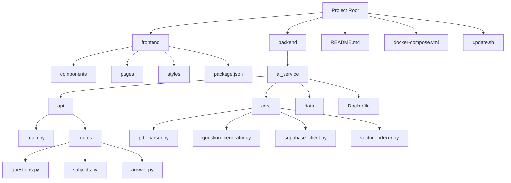

# Directory Structure Breakdown

## Project Structure Overview

The repository follows a clean full-stack architecture with distinct backend and frontend directories. The structure is organized to separate concerns, with backend handling AI processing and data management, while frontend focuses on user interface and experience.

## Backend Directory

### ai_service
The core AI service directory containing the FastAPI application:

#### api
Contains the API routes and models:
- **main.py**: FastAPI application entry point
- **auth.py**: Authentication middleware
- **models.py**: Pydantic data models
- **routes/**: API endpoint definitions
  - **questions.py**: Question generation endpoints
  - **auth.py**: Authentication endpoints
  - **answer.py**: Answer evaluation endpoints
  - **subjects.py**: Subject management endpoints
  - **feedback.py**: User feedback endpoints
  - **model_performance.py**: Model performance tracking endpoints
  - **ocr.py**: OCR service endpoints
  - **cleanup.py**: Data cleanup endpoints

#### core
Contains the business logic:
- **question_generator.py**: AI question generation engine
- **vector_indexer.py**: Document vectorization and search
- **supabase_client.py**: Database integration
- **pdf_parser.py**: PDF processing
- **cache_service.py**: Caching layer implementation
- **rate_limiter.py**: Rate limiting functionality
- **upstash_search_client.py**: Upstash search integration
- **redis_connection.py**: Redis connection utility

#### data
Contains processed question data:
- **chunks.json**: Flat structure of extracted questions from PDFs
- **chunks_organized.json**: Organized structure of questions grouped by GS paper and topic

#### Other files
- **requirements.txt**: Python dependencies
- **Dockerfile**: Backend containerization
- **run_indexing.py**: Vector indexing orchestration
- **process_pdf_keywords.py**: PDF keyword processing
- **test_upstash.py**: Upstash integration tests
- **test_multiline_topics.py**: Multiline topic handling tests
- **load_test_config.py**: Load testing configuration
- **diagnose_documents.py**: Document diagnosis utility
- **redis_connection.py**: Redis connection utility

### db
Contains the database schema and migrations:
- **01_user_management.sql**: User tables and functions
- **02_question_generation.sql**: Question generation tables
- **03_analytics_feedback.sql**: Analytics and feedback tables
- **04_caching_performance.sql**: Caching system tables
- **05_guest_management.sql**: Guest user handling
- **06_statistics_dashboard.sql**: Dashboard functions
- **07_utilities.sql**: Helper functions
- **08_vector_storage.sql**: Vector storage tables
- **09_performance_indexes.sql**: Performance optimization indexes
- **setup_automatic_cleanup.sql**: Automated maintenance
- **verify_deployment.sql**: Deployment verification
- **migration_add_model_column.sql**: Migration to add model column
- **migration_add_feedback_type_column.sql**: Migration to add feedback type column
- **migration_add keyword mode.sql**: Migration to add keyword mode support

## Frontend Directory

### components
React components organized by functionality:
- **ui/**: shadcn/ui components
- **AuthForm.tsx**: Authentication form
- **Chatwindow.tsx**: Chat interface component
- **Dashboard.tsx**: Main dashboard component
- **DocPage.tsx**: Documentation page component
- **DocSidebar.tsx**: Documentation sidebar component
- **FloatingFeedbackButton.tsx**: Floating feedback button
- **FloatingHeader.tsx**: Floating header component
- **ImageCard.tsx**: Image display card
- **QuestionDisplay.tsx**: Question display component
- **QuestionGenerator.tsx**: Question generation interface
- **QuestionHistory.tsx**: Question history component
- **ScreenshotUploader.tsx**: Screenshot upload component
- **intrepidq-logo.tsx**: Logo component
- **combobox.tsx**: Combobox component
- **theme-provider.tsx**: Theme provider

### hooks
Custom React hooks:
- **use-toast.ts**: Toast notification hook
- **useAuth.ts**: Authentication hook

### pages
Next.js pages:
- **_app.tsx**: Application entry point
- **index.tsx**: Home page
- **dashboard.tsx**: Dashboard page
- **about.tsx**: About page
- **profile.tsx**: User profile page
- **privacy-policy.tsx**: Privacy policy page
- **terms-of-service.tsx**: Terms of service page
- **acceptable-use-policy.tsx**: Acceptable use policy page
- **blog.tsx**: Blog listing page
- **sitemap.xml.tsx**: Sitemap
- **auth/**: Authentication pages
  - **signin.tsx**: Sign in page
- **blog/**: Blog posts
  - **how-intrepidq-enhances-upsc-preparation.tsx**: Blog post
  - **webapp-updates-and-new-features.tsx**: Blog post

### Other files
- **styles/globals.css**: Global styles
- **Dockerfile**: Frontend containerization
- **components.json**: Component configuration
- **jest.config.js**: Jest configuration
- **jest.setup.js**: Jest setup
- **middleware.ts**: Middleware configuration
- **next-env.d.ts**: Next.js environment types
- **next.config.js**: Next.js configuration
- **package.json**: Node.js dependencies
- **postcss.config.js**: PostCSS configuration
- **tailwind.config.js**: Tailwind CSS configuration
- **tsconfig.json**: TypeScript configuration

## Root-Level Files
- **README.md**: Project documentation
- **.gitignore**: Git ignore rules
- **LICENSE**: License information
